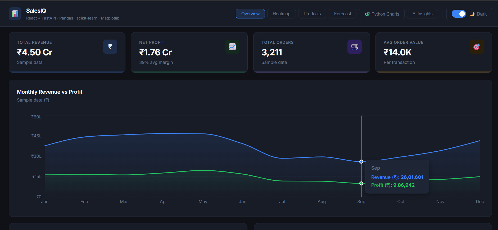
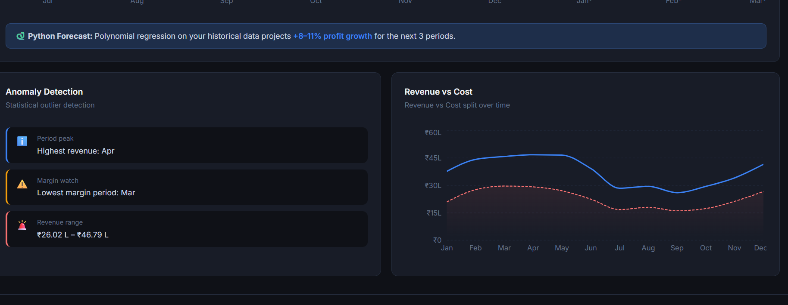
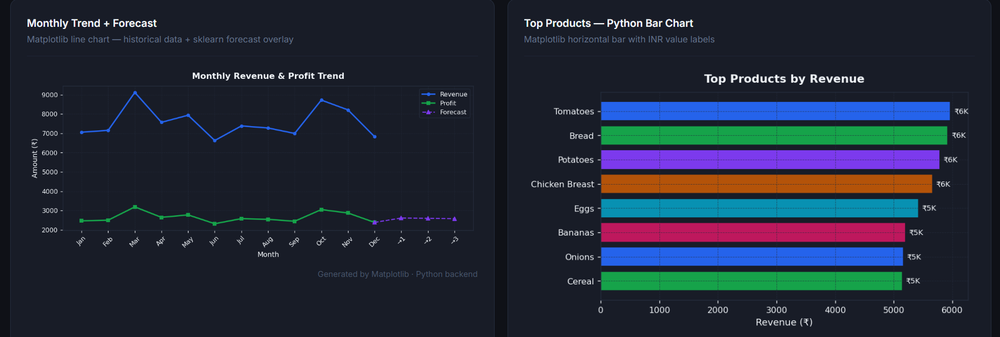

# SalesIQ — Sales Analytics Dashboard

A full stack sales dashboard I built using React on the frontend and Python (FastAPI) on the backend. You can upload your own CSV or Excel file and it automatically generates charts, forecasts, and insights from your data.

---

## What it does

- Upload a CSV or Excel file and all the charts update with your actual data
- Python backend processes the file using Pandas and returns everything ready to display
- Predicts future sales trends using scikit-learn (machine learning)
- Detects unusual spikes or drops in your data automatically
- Generates additional statistical charts using Matplotlib and Seaborn

- Light and dark mode

---

## Tech Stack

**Frontend**
- React
- Recharts (for interactive charts)
- Vite

**Backend**
- FastAPI (Python)
- Pandas (data processing)
- scikit-learn (sales forecasting)
- Matplotlib + Seaborn (chart generation)
- pdfplumber (PDF support)

---

## Getting Started

### Backend
```bash
cd backend
pip install -r requirements.txt
uvicorn main:app --reload
```
Backend runs on `http://localhost:8000`
API docs available at `http://localhost:8000/docs`

### Frontend
```bash
cd frontend
npm install
npm run dev
```
Frontend runs on `http://localhost:5173`

---

## How to use it

1. Run both the backend and frontend
2. Open the app in your browser
3. Upload a CSV or Excel file with your sales data
4. Match your column names to the right fields (the app auto-detects most of them)
5. Click **Process with Python** and all charts will update with your data

Your CSV just needs something like a date column, a revenue column, and optionally product/region columns. The app figures out the rest.

---

## Project Structure

```
salesiq-fullstack/
├── backend/
│   ├── main.py                  # FastAPI app
│   ├── requirements.txt
│   ├── routers/                 # API endpoints
│   └── utils/
│       ├── data_processor.py    # Pandas data processing
│       ├── forecaster.py        # scikit-learn forecasting
│       └── chart_generator.py   # Matplotlib + Seaborn charts
│
└── frontend/
    ├── src/
    │   ├── App.jsx
    │   ├── components/          # UI components and chart tabs
    │   ├── hooks/               # File upload logic
    │   └── utils/               # API calls, formatters
    └── package.json
```

---

## Screenshots

> 
> 
>

---


